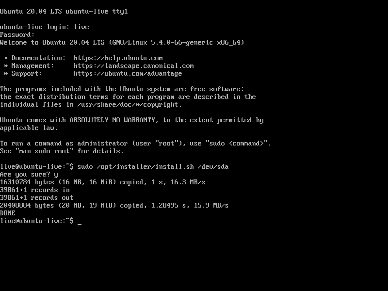

# openwrt iso builder

# Builder Usage

```bash
$ make
```

# Installer Usage

## 1. Attach ISO

## 2. Login

> Username: live
> 
> Password: live
>

## 3. Install

```bash
$ sudo /opt/installer/install.sh /dev/sda
```



# License

Apache-2.0


